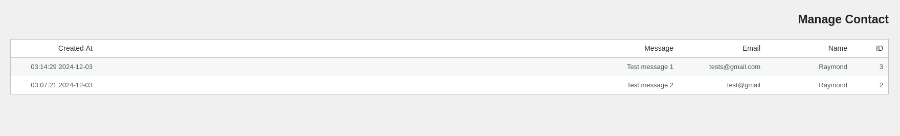

# Contact Form Wordpress

A Simple Contact Form Plugin for Wordpress.

# How to use

with install plugin can Display the following shotcode in the WordPress template tab of the form.

```php
<?php echo do_shortcode('[contact-form]'); ?>
```
Or in Page Wordpress
```php
[contact-form]
```

# Screenshots

<table class="table">
  <thead>
    <tr>
      <th scope="col" width="1000px">Contact Page</th>
      <th scope="col" width="1000px">Contact Admin</th>
    </tr>
  </thead>
  <tbody>
    <tr>
      <td>
        
      </td>
      <td>
        
      </td>
    </tr>
  </tbody>
</table>